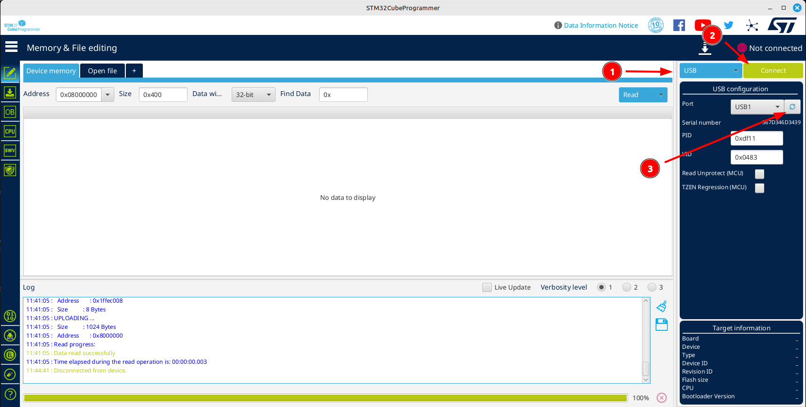
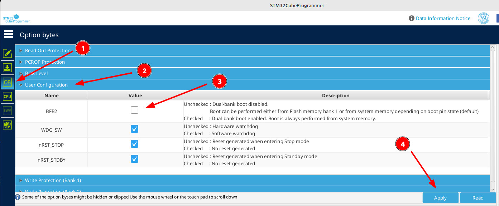

# 更新遇到问题？

如果您在阅读此页面，说明您在尝试更新或更新后遇到了一些问题。请查看以下问题列表及其可能的解决步骤，看看是否有符合您遇到的问题。如果没有，您可以加入我们的 [Discord](https://discord.gg/wF9wUKnZ6H)（通常会有人可以帮助您），访问我们的 [GitHub Discussions](https://github.com/EdgeTX/edgetx/discussions) 论坛，或者使用 [RCGroups 论坛线程](https://www.rcgroups.com/forums/showthread.php?3916381-Official-EdgeTX-Discussion-Thread)，如果您更喜欢这种方式。

#### **我正在使用 EdgeTX Buddy 刷写，但我的遥控器无法被检测到**

1. 确保将遥控器连接到电脑时，遥控器是 **关闭** 的。如果您收到关于选择 USB 模式的提示，您将无法更新。DFU 模式（用于刷写固件）仅在遥控器关闭的情况下插入 USB 时才能运行。
2. 您的遥控器是否有引导/DFU 按钮？请查看 [访问 DFU 和引导加载器模式](../edgetx-how-to/access-dfu-and-bootloader-mode.md) 页面，确认您的遥控器是否需要在插入 USB 时按住某个按钮。
3. 您可能遇到了驱动问题。如果您使用的是 Windows，可以首先尝试 [ImpulseRC Driver Fixer](https://impulserc.com/pages/downloads) 工具。另外，您也可以访问 STMicroelectronics 网站，下载免费的 [STM32CubeProgrammer 工具](https://www.st.com/en/development-tools/stm32cubeprog.html#get-software)，其中包含必要的驱动程序，适用于所有主要操作系统。请注意，该工具需要在 STMicroelectronics 网站注册一个免费账号，这是用于编程所有支持的遥控器微控制器的官方工具。
4. 尝试更换 USB 数据线。并非所有数据线都是一样的，有些数据线仅支持充电功能。

#### **我更新了 EdgeTX，但现在我的遥控器无法开机或行为异常**

1. 首先，仔细检查您是否选择了正确的遥控器名称/目标。一些错误选择可能仍能启动，但按钮和控制可能无法正确工作，或者屏幕可能上下颠倒。其他组合可能完全无法工作，或者让遥控器表现异常，甚至需要断开电池才能关闭。如果您刷写了错误的目标，只需打开 EdgeTX Buddy，选择正确的遥控器型号并重新刷写固件。
2. 一些遥控器的微控制器可能设置了错误的选项位，导致无法在 EdgeTX 2.10 或更高版本上启动。虽然确切原因尚不清楚，但解决方法相对简单。请参见以下（折叠的）说明了解更多信息。

重置选项位

1. 安装 STM32CubeProgrammer 工具（需要在 STMicroelectronics 网站创建一个免费账号）。在关闭的情况下将遥控器插入电脑，以进入 DFU 模式。如果您不确定遥控器是否需要按住引导/DFU 按钮插入 USB，请检查 [访问 DFU 和引导加载器模式](../edgetx-how-to/access-dfu-and-bootloader-mode.md) 页面。
2. 启动 STM32CubeProgrammer 工具。如果工具已经打开，请确认界面如下（点击图片可查看大图）：\
   \
   \
   确保设备类型 (1) 显示为 USB，然后按下连接按钮 (2)。如果端口字段为空，请尝试点击刷新按钮 (3)。
3. 转到 "Option bytes" 页面 (1)，然后选择 User Configuration (2)。检查 "BFB2" (3) 的状态。如果勾选了，请取消勾选，如图所示，然后点击应用按钮 (4)。随后，点击 "Disconnect" 按钮并断开遥控器。\
   
4. 如果问题是这个，完成后您的遥控器应该可以正常启动。

3. 如果您仍然无法解决问题，可以参考这个指南：[如何修复变砖的遥控器](https://github.com/EdgeTX/edgetx/wiki/Unbrick-your-radio)。
