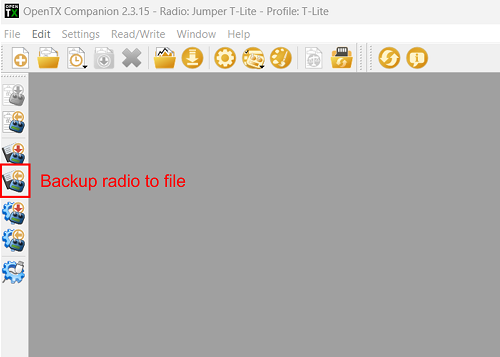
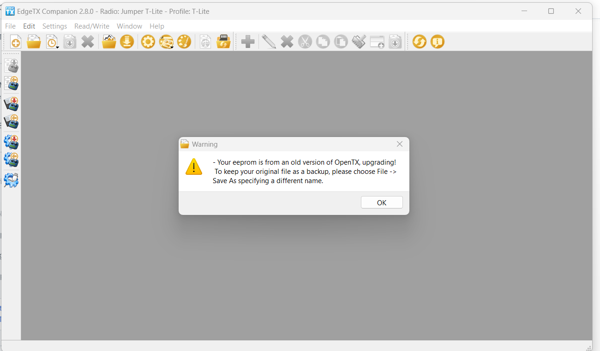

# 使用引导加载器从 OpenTX 迁移到 EdgeTX

要从 OpenTX 更新到 EdgeTX，您需要在计算机上安装 OpenTX 和 EdgeTX Companion。您可以通过以下链接下载 OpenTX Companion：[https://downloads.open-tx.org/2.3/release/companion/](https://downloads.open-tx.org/2.3/release/companion/)。EdgeTX Companion 可通过以下链接下载：[https://github.com/EdgeTX/edgetx/releases](https://github.com/EdgeTX/edgetx/releases)（文件名格式：edgetx-cpn-\[操作系统]-\[版本].zip）。

### 备份模型

打开遥控器，导航至 **遥控器设置** -> **硬件**，滚动到屏幕底部并选择 **EEPROM 备份**。如果没有该选项，说明您的遥控器未使用 EEPROM 存储数据，可以跳过此步骤。

<figure><figcaption></figcaption></figure>

打开遥控器电源后，通过 USB 将其连接到电脑。当遥控器提示选择 USB 模式时，选择 **USB 存储**。

在电脑上，将 SD 卡的全部内容复制到安全位置。如果以后需要切换回 OpenTX，这些文件仍可使用。如果您已进行 EEPROM 备份，请检查 EEPROM 文件夹，确保其中有最近的备份文件。

启动 OpenTX Companion。

选择左侧屏幕中的 **备份遥控器到文件** 图标。选择保存位置（如桌面）并为文件命名。

<figure><figcaption></figcaption></figure>

保存文件后，关闭 OpenTX Companion。断开遥控器与电脑的连接并关闭遥控器。

### 准备 SD 卡

下载并解压适用于您遥控器类型的 EdgeTX SD 卡内容。SD 卡内容可从以下地址获取：[https://github.com/EdgeTX/edgetx-sdcard/releases](https://github.com/EdgeTX/edgetx-sdcard/releases)

以下是适用于不同遥控器类型的 .zip 文件说明：

- **c480x272zip**（480x272 水平彩屏）- 适用于 TX16s、T16、Horus x10s、Horus x12s 及大多数彩屏遥控器
- **c480x320**（480x320 水平彩屏）
- **c320x480zip**（320x480 垂直彩屏）- 适用于 FlySky Nirvana NV14、EL18
- **bw128x64.zip**（128x64 单色屏）- 适用于除 X9D 系列以外的所有单色屏遥控器
- **bw212x64zip**（212x64 单色屏）- 适用于 X9D、X9D Plus、X9D Plus 2019

删除 SD 卡上的所有内容，将解压后的文件复制到空白的 SD 卡中（如果进行了格式化，请确保格式为 FAT32）。

复制您自定义的声音、模型图片、小部件或 Lua 脚本到相应文件夹。

如果未传输现有声音，可以下载所需的声音包：[https://github.com/EdgeTX/edgetx-sdcard-sounds/releases](https://github.com/EdgeTX/edgetx-sdcard-sounds/releases)，解压后复制到 SD 卡的 **Sounds** 文件夹中。

### 刷写 EdgeTX 引导加载器和固件

下载当前版本的 EdgeTX 固件。可以直接从 GitHub 下载最新版本 .zip 文件（文件名格式：edgetx-firmware-vX.X.X.zip）：[https://github.com/EdgeTX/edgetx/releases/latest](https://github.com/EdgeTX/edgetx/releases/latest)

解压文件后，将对应的 .bin 文件（与您的遥控器类型相符）保存到 SD 卡上的 **Firmware** 文件夹。

打开遥控器，导航至 SD 卡页面，打开 **Firmware** 文件夹，选择刚复制到 SD 卡上的 EdgeTX 固件文件。选择 **刷写引导加载器** 选项。引导加载器将被刷写为 EdgeTX 引导加载器。

返回主屏幕并关闭遥控器电源。

同时按住微调开关 T4 和 T1 并按电源按钮，将遥控器启动至引导加载器模式。


对于 Jumper T-Pro，您需要按住 Boot0 按钮并插入 USB 才能进入 DFU 模式。


进入 EdgeTX 引导加载器后，选择 **写入固件** 选项。选择保存到 SD 卡上的 EdgeTX 固件文件，长按刷写。

刷写完成后，选择 **退出**。遥控器将重启，您将看到 **Welcome EdgeTX**。

首次启动 EdgeTX 时，您将收到 **存储警告：丢失或错误的遥控器数据** 的提示。按下白色圆圈按钮或滚轮跳过警告。随后会收到另一个存储警告：**存储准备**。再次按下白色圆圈按钮或滚轮。完成 SD 卡准备后，将进入校准屏幕，请校准您的遥控器。

此时，EdgeTX 引导加载器、固件和 SD 卡内容均已安装。最后一步是将您的模型从 OpenTX 转换到 EdgeTX。

### 从 OpenTX 恢复模型

打开遥控器电源，通过 USB 将其连接到电脑。当遥控器提示选择 USB 模式时，选择 **USB 存储**。

启动 EdgeTX Companion。如果尚未创建遥控器配置文件，请创建一个并确保其为活动配置文件。

在 Companion 左上角，选择 **文件** -> **打开**，然后选择之前备份的 OpenTX 文件。将显示警告信息，点击 **OK**。

<figure><figcaption></figcaption></figure>

在 EdgeTX Companion 中，您将看到所有来自 OpenTX 的模型。点击 **写入模型和设置到遥控器** 按钮。系统将提示您会覆盖遥控器上的所有模型，点击 **是**。

<figure><figcaption></figcaption></figure>

模型和设置将写入遥控器。完成后将显示提示信息，点击 **OK**。断开遥控器与 USB 的连接并关闭 EdgeTX Companion。

<figure><figcaption></figcaption></figure>

### 恭喜，您已成功迁移到 EdgeTX！

您的所有模型已更新为 EdgeTX 的 .yml 格式，并安装了 EdgeTX 声音包。您现在可以开始使用 EdgeTX。


_遗憾的是，无法从 OpenTX 直接迁移小部件的设置，您需要在 EdgeTX 中手动重新设置。_



OpenTX 的 Lua 脚本仍保留在 SD 卡上，但并非所有脚本都兼容 EdgeTX。可能需要重新安装才能使其正常工作。您可以在此处找到兼容 EdgeTX 的 Lua 脚本列表：[https://github.com/EdgeTX/lua-scripts](https://github.com/EdgeTX/lua-scripts)

