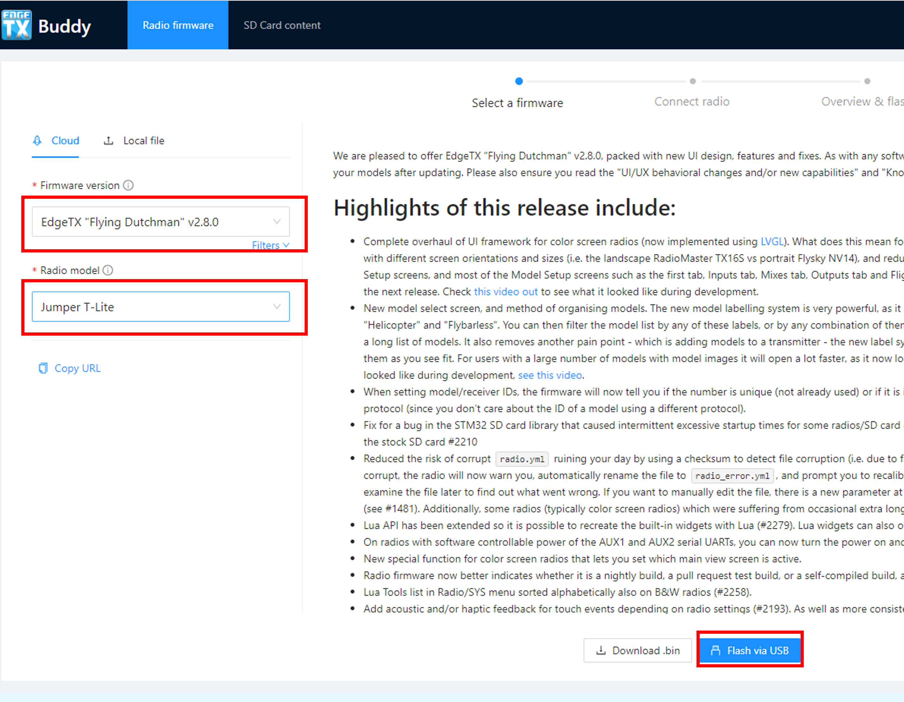
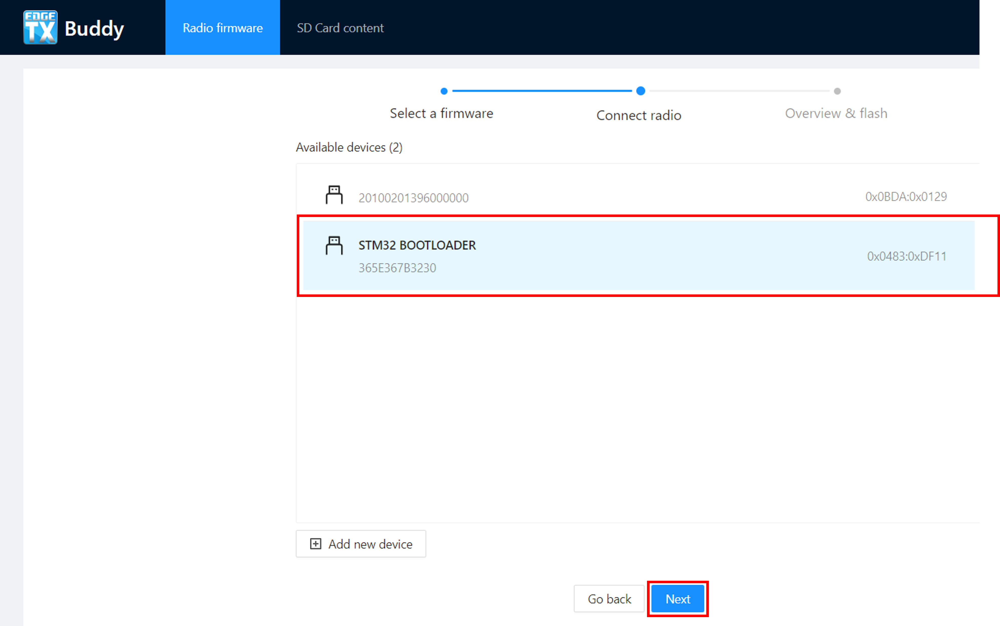
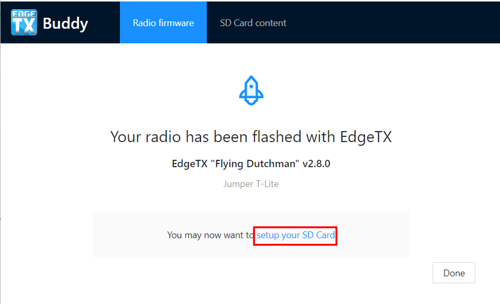
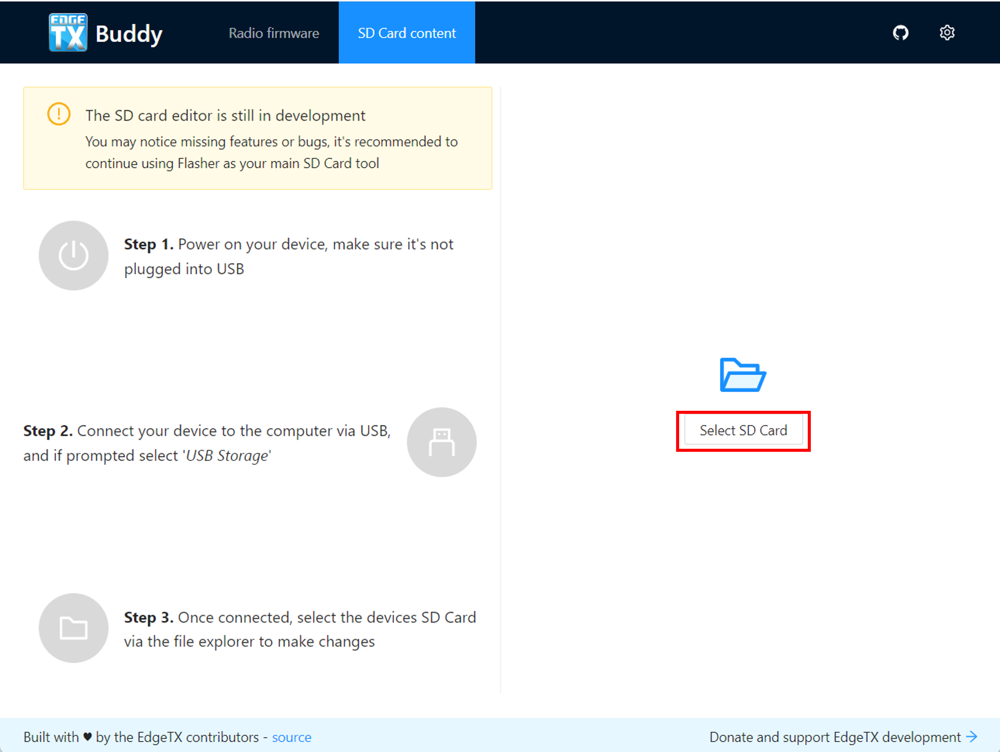
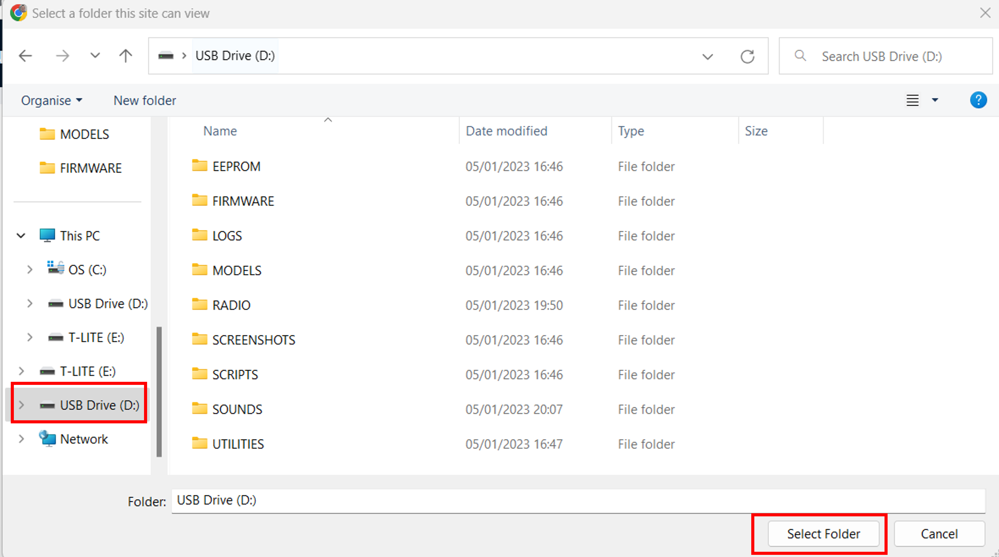
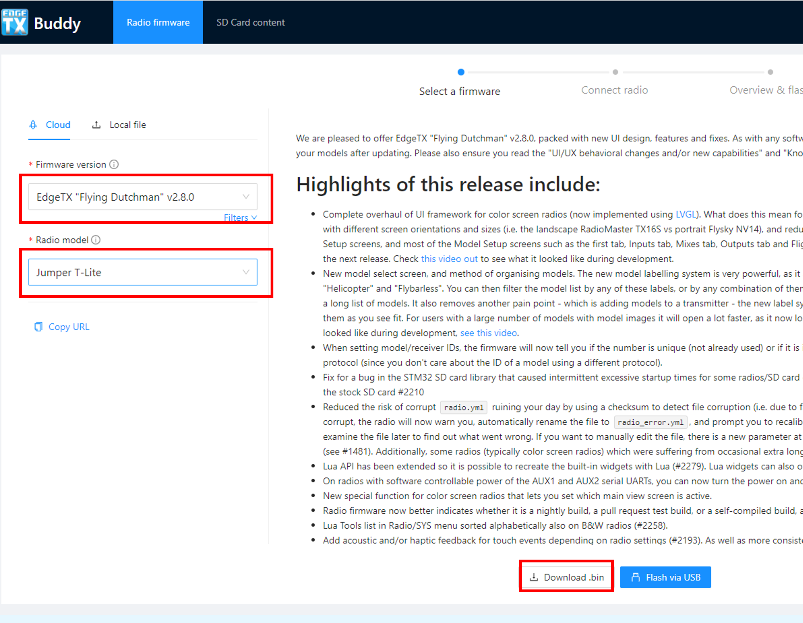

# 使用 EdgeTX Buddy 从早期版本的 EdgeTX 更新

### 备份 SD 卡内容

**在更新遥控器之前，我们强烈建议您按照以下步骤备份当前 SD 卡内容。**

打开遥控器电源，通过 USB 将其连接到电脑。当遥控器提示选择 USB 模式时，选择 **USB 存储**。

在电脑上，将 SD 卡的全部内容复制到安全的位置。如果需要回滚更新，可以重新使用这些文件。

### 更新引导加载器和固件

在遥控器关闭的情况下，通过 USB 将其连接到电脑。这会将遥控器连接到电脑的 DFU 模式。


对于 Jumper T-Pro，您需要按住 Boot0 按钮并插入 USB 才能进入 DFU 模式。


访问以下网站：[https://buddy.edgetx.org/](https://buddy.edgetx.org/)

选择 **固件版本** 和 **遥控器型号**，然后点击 **通过 USB 刷写**。

<figure><figcaption></figcaption></figure>

在下一屏幕，选择 **STM32 Bootloader** 设备并点击 **下一步**。

<figure><figcaption></figcaption></figure>

如果未显示 **STM32 Bootloader** 设备，选择 **添加新设备**。在弹出窗口中选择 **STM32 Bootloader** 并点击 **连接**。

<figure><figcaption></figcaption></figure>


**注意：** 如果无法选择 STM32 BOOTLOADER，通常说明您的电脑驱动程序存在问题。您可以安装 **ImpulseRC Driver Fixer** 来修复驱动程序。下载链接：[https://impulserc.blob.core.windows.net/utilities/ImpulseRC\_Driver\_Fixer.exe](https://impulserc.blob.core.windows.net/utilities/ImpulseRC\_Driver\_Fixer.exe)



如果您的电脑始终无法检测到 STM32 BOOTLOADER，则必须使用引导加载器方法更新 EdgeTX。跳过本节其余部分并参考 [**更新 SD 卡内容部分**](update-from-opentx-to-edgetx-1.md#更新-SD-卡内容)。完成 SD 卡更新后，我们将指导您通过引导加载器更新固件。


选择 **STM32 Bootloader** 设备并点击 **下一步** 后，将显示确认屏幕以验证您的设置。确认所有内容正确（版本、遥控器和设备）后，点击 **开始刷写** 按钮。

<figure><figcaption></figcaption></figure>

EdgeTX Buddy 将开始刷写过程，屏幕会显示进度。

<figure><figcaption></figcaption></figure>

刷写完成后，下一步是更新 SD 卡内容。尽管不总是必须更新 SD 卡内容，但建议您这样做。要更新 SD 卡内容，请点击完成屏幕上的 **设置您的 SD 卡** 链接，这会带您进入 SD 卡内容页面。

<figure><figcaption></figcaption></figure>

### 更新 SD 卡内容

断开遥控器与电脑的连接并启动遥控器。

打开遥控器电源后，通过 USB 将其连接到电脑。当遥控器提示选择 USB 模式时，选择 **USB 存储**。点击 **选择 SD 卡** 选项，然后导航到您的 EdgeTX SD 卡。

<figure><figcaption></figcaption></figure>

EdgeTX SD 卡将作为 USB 驱动器挂载到您的电脑。选择 USB 驱动器后点击 **选择文件夹**。

<figure><figcaption></figcaption></figure>


您的电脑可能会提示要求 EdgeTX Buddy 获取 SD 卡内容的权限。这是正常的，Buddy 需要权限以修改 SD 卡上的文件。


在 SD 卡内容页面，确认固件版本和遥控器型号仍然正确，然后选择所需的声音包语言。点击 **应用更改**。状态窗口会弹出并显示安装进度。文件安装完成后，状态窗口会自动关闭。

<figure><figcaption></figcaption></figure>


**注意：** EdgeTX Buddy 只会更新默认 EdgeTX 安装的一部分 SD 卡文件。它不会修改或删除您添加的其他文件（如 LUA 脚本、声音文件、图片、自定义主题、模型文件、遥控器设置文件等）。


### 恭喜，您已成功更新 EdgeTX！

如果您无法使用 EdgeTX Buddy 刷写固件，请按照以下步骤通过引导加载器刷写固件。保持遥控器通过 USB 连接到电脑并处于 USB 存储模式。

### 使用引导加载器更新遥控器固件

返回到 **遥控器固件** 选项卡。

选择 **固件版本** 和 **遥控器型号**，然后点击 **下载 .bin 文件**。

固件下载完成后，系统会要求选择保存位置。导航到遥控器的 SD 卡并选择 **Firmware** 文件夹，然后点击 **保存**。

<figure><figcaption></figcaption></figure>

断开 USB 数据线并关闭遥控器电源。

同时按住微调开关 T4 和 T1 并按电源按钮，将遥控器启动至引导加载器模式。

进入引导加载器后，选择 **写入固件** 选项。选择保存到 SD 卡上的 EdgeTX 固件文件，长按刷写。

刷写完成后，选择 **退出**。遥控器将重启并运行更新后的 EdgeTX 版本。

### 恭喜，您已成功更新 EdgeTX！
